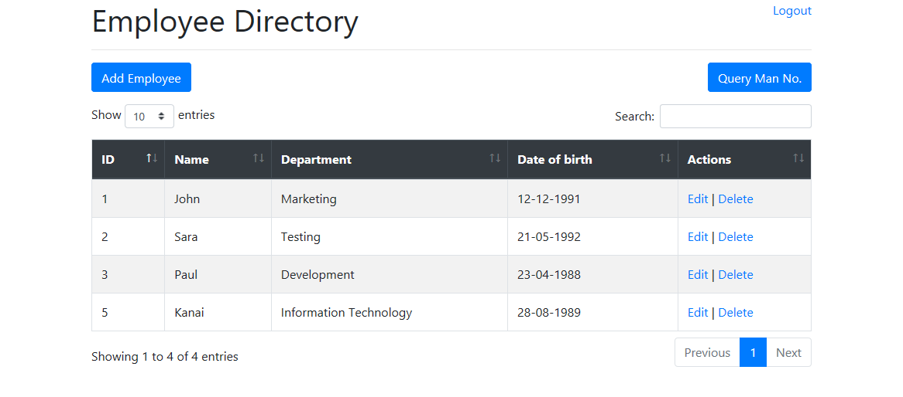
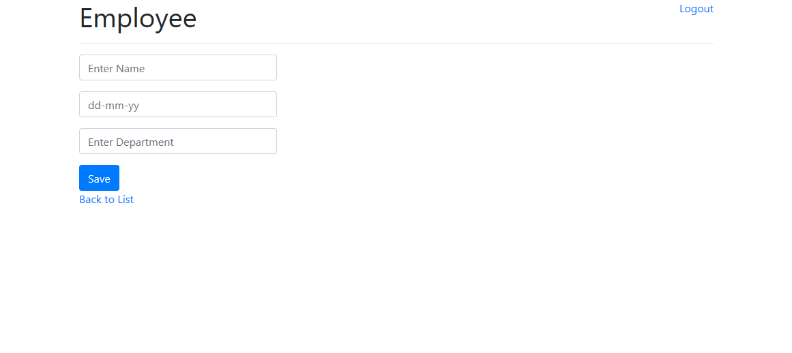
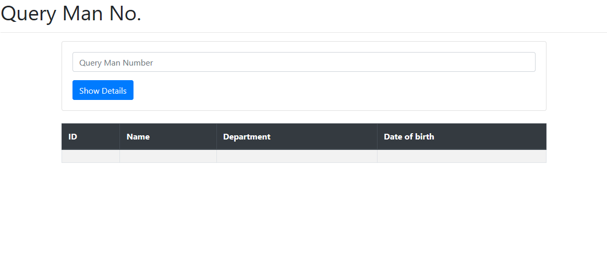

# Employee-Dir

Employee Dir Application a Java EE Program that will perform the following tasks:  
i. use mysql database to store employees of five.   
ii. add particular Employee to the database.  
iii. prompt user for a man number and request the server to retrieve the full record of that particular Employee.  

  

1. View to list all the employees in the database

  

2. View to add an employee

  

3. View to retrieve View

  

4. Retrieve the full record of a particular Employee

